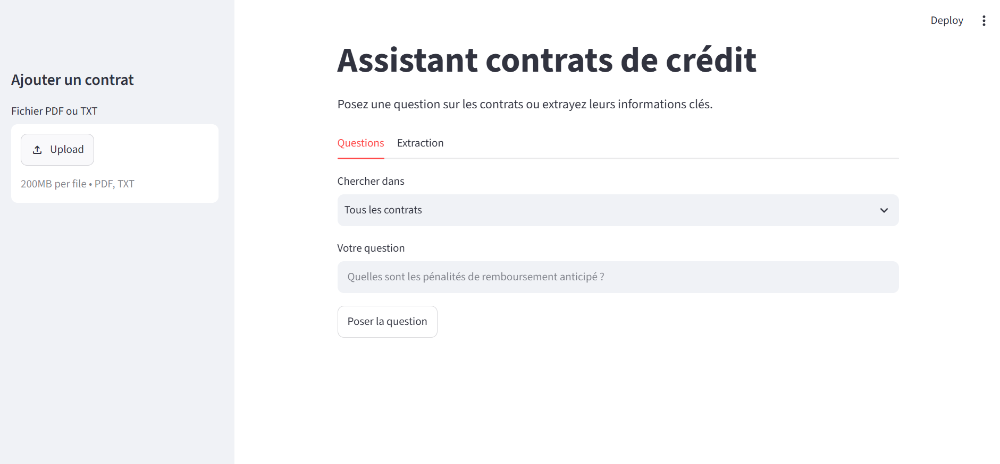

# 🏦 Assistant RAG pour contrats de crédit

Assistant intelligent qui **répond aux questions sur des contrats de crédit** et **extrait automatiquement leurs informations clés**, grâce à un LLM local et à la technique **RAG** (*Retrieval-Augmented Generation*).

Tout fonctionne **en local** avec Ollama : aucune donnée ne quitte la machine, ce qui est essentiel pour des documents bancaires confidentiels.


---

## 🎯 Le problème

Les contrats de crédit sont longs, techniques et nombreux. Retrouver une information précise (un TEG, une pénalité de remboursement anticipé, une garantie) demande du temps. Un LLM seul ne connaît pas ces contrats et peut **inventer** des réponses.

**La solution :** un système RAG qui retrouve d'abord les bons articles dans les contrats, puis demande au LLM de rédiger une réponse **uniquement à partir de ces articles**, en citant ses sources.

## ✨ Fonctionnalités

- **Questions-réponses** sur les contrats, avec le contrat et l'article cités en source
- **Recherche dans tous les contrats** ou **dans un contrat précis**
- **Extraction automatique** des informations clés en JSON (prêteur, montant, durée, taux, TEG, frais, garanties, remboursement anticipé…)
- **Ajout de nouveaux contrats** (PDF ou TXT) directement depuis l'interface
- **Garde-fous** : réponse polie aux salutations, refus d'inventer un chiffre, redirection des questions hors sujet
- **API REST** prête à être intégrée dans une application existante (par exemple un backend Spring Boot)

## 🏗️ Architecture

```
Interface (Streamlit)  ou  backend d'une application
              │  POST /question
              ▼
        API RAG (FastAPI)
              │
              ├── 1. Recherche sémantique ──▶ Chroma (base vectorielle)
              │                                  ▲
              │                                  │ vecteurs (bge-m3)
              │
              └── 2. Articles + question ──▶ Ollama (qwen2.5:7b)
                                                 │
                                                 ▼
                                      Réponse + sources
```

**Préparation (une fois) :** contrats → extraction du texte → découpage par article → vecteurs (`bge-m3`) → Chroma

**À chaque question :** question → vecteur → les 4 articles les plus proches → le LLM rédige la réponse

## 🛠️ Technologies

| Rôle | Outil |
|---|---|
| LLM (rédaction des réponses) | **Qwen 2.5 7B** via **Ollama** |
| Embeddings (recherche sémantique) | **bge-m3** (multilingue) via Ollama |
| Base vectorielle | **Chroma** |
| Lecture des PDF | **PyMuPDF** |
| Découpage du texte | **LangChain Text Splitters** |
| API | **FastAPI** |
| Interface de démonstration | **Streamlit** |
| Langage | **Python** |

## 📁 Structure du projet

```
rag-contrats-bancaires/
├── contrats/              # Les contrats utilisés par le RAG (un fichier par contrat)
├── textes_source/         # Textes d'origine (plusieurs contrats par fichier)
├── notebooks/
│   └── tests.ipynb        # Tests de chaque étape du pipeline
├── src/
│   ├── extraction.py      # Lecture des PDF et TXT
│   ├── decoupage.py       # Découpage par article + titre du contrat sur chaque morceau
│   ├── indexation.py      # Embeddings + stockage dans Chroma
│   ├── rag.py             # Recherche + appel au LLM + extraction JSON
│   └── api.py             # API FastAPI
├── interface.py           # Interface Streamlit
└── requirements.txt
```

## 🚀 Installation

**Prérequis :** Python 3.10 ou plus, et [Ollama](https://ollama.com).

```bash
# 1. Cloner le projet
git clone https://github.com/FARAHEltem/rag-contrats-bancaires.git
cd rag-contrats-bancaires

# 2. Installer les bibliothèques
python -m pip install -r requirements.txt

# 3. Télécharger les modèles
ollama pull qwen2.5:7b      # ou qwen2.5:3b sur une machine avec 8 Go de RAM
ollama pull bge-m3
```

## ▶️ Utilisation

Toutes les commandes se lancent depuis le dossier principal du projet.

```bash
# 1. Indexer les contrats (à refaire quand les contrats changent)
python src/indexation.py

# 2. Lancer l'API (terminal 1)
python -m uvicorn api:app --app-dir src --reload

# 3. Lancer l'interface (terminal 2)
python -m streamlit run interface.py
```

- Interface : http://localhost:8501
- Documentation interactive de l'API : http://localhost:8000/docs

## 🔌 API

| Méthode | Adresse | Description |
|---|---|---|
| `GET` | `/contrats` | Liste des contrats disponibles |
| `POST` | `/contrats` | Ajoute et indexe un contrat (PDF ou TXT) |
| `POST` | `/question` | Pose une question, renvoie la réponse et ses sources |
| `POST` | `/extraction/{contrat}` | Renvoie les informations clés d'un contrat en JSON |

**Exemple :**

```bash
POST /question
{ "texte": "Quel est le TEG du prêt personnel non affecté ?" }
```

```json
{
  "reponse": "Le TEG du prêt personnel non affecté est de 12,20 % (contrat_07, article 2).",
  "sources": [{ "contrat": "contrat_07", "article": "2" }]
}
```

## 📊 Données

Le projet utilise **30 contrats de crédit fictifs** conformes au contexte marocain (montants en MAD, références à la loi 31-08 et au taux maximum de Bank Al-Maghrib) : immobilier, consommation, automobile, LOA, renouvelable, professionnel, crédit-bail et Mourabaha.

Les contrats sont **entièrement fictifs** (prêteurs, emprunteurs, identifiants inventés) : aucune donnée personnelle réelle n'est utilisée. Un tableau récapitulatif des 30 contrats sert de **corrigé** pour évaluer les réponses du système.

## 📈 Évaluation

> *À compléter avec vos résultats.*

| Indicateur | Résultat |
|---|---|
| Questions testées | 15 |
| Bonnes réponses | 12 / 12 (100 %) |
| Bon contrat retrouvé par la recherche | 12 / 12 (100 %) |
| Refus correct quand l'information est absente | X / 3 |

## 🧭 Choix techniques

- **Découpage par article** plutôt que par taille fixe : chaque morceau correspond à une clause complète.
- **Titre du contrat ajouté à chaque morceau** : la recherche sait toujours de quel contrat vient un article, ce qui évite de mélanger 30 contrats aux clauses très proches.
- **LLM local (Ollama)** : confidentialité des données et aucun coût par requête.
- **Température à 0 et consigne stricte** : réponses stables, sources citées, pas d'invention de chiffres.
- **Service séparé avec une API** : intégrable dans n'importe quelle application (Java, JavaScript, PHP…) sans modifier son code en profondeur.

## 🔭 Améliorations prévues

- [ ] OCR (Tesseract) pour lire les contrats scannés
- [ ] Script d'évaluation automatique à partir du tableau récapitulatif
- [ ] Intégration dans une application Spring Boot + React (gestion des contrats)
- [ ] Conteneurisation avec Docker Compose
- [ ] Support des contrats en arabe

## ⚠️ Avertissement

Projet réalisé à des fins de formation. L'assistant est une **aide à la lecture** et ne remplace pas l'avis d'un juriste ou d'un conseiller bancaire.

## 👤 Auteur

**[El-Montaser Farahe]** – [LinkedIn](https://www.linkedin.com/in/farahe-el-montaser-30a422368) · [GitHub](https://github.com/FARAHEltem)
